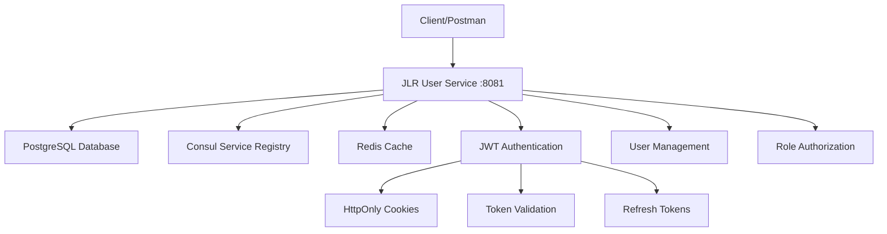

# JLR Parts System - User Service

[](https://www.oracle.com/java/)
[](https://spring.io/projects/spring-boot)
[](https://www.postgresql.org/)

## Overview

The **JLR User Service** is a production-ready microservice that provides secure user authentication and management for the Jaguar Land Rover Parts Ordering System. Built with enterprise-grade security patterns, this service handles user registration, JWT-based authentication, and role-based access control for dealerships and customers.

### Key Features

- 🔐 **JWT Authentication** with httpOnly cookies for XSS protection
- 👥 **Role-Based Access Control** (CUSTOMER, DEALER_EMPLOYEE, DEALER_MANAGER, ADMIN)
- 🛡️ **Enterprise Security** with BCrypt password hashing and CSRF protection
- 🚀 **Microservices Architecture** with Consul service discovery
- 📊 **Production Monitoring** with Spring Boot Actuator
- 🗄️ **Database Integration** with PostgreSQL and automatic migrations
- ✅ **Comprehensive Validation** with detailed error responses
- 🔍 **Audit Logging** with user activity tracking

## Architecture



### Technology Stack

| Component | Technology | Version | Purpose |
|-----------|------------|---------|---------|
| **Runtime** | Java | 17 | Application runtime |
| **Framework** | Spring Boot | 3.3.3 | Microservice framework |
| **Security** | Spring Security | 6.x | Authentication & authorization |
| **Database** | PostgreSQL | 15+ | Primary data storage |
| **Cache** | Redis | 7.0+ | Session & token caching |
| **Service Discovery** | Consul | 1.15+ | Service registration |
| **Authentication** | JWT (JJWT) | 0.12.5 | Stateless authentication |
| **Migration** | Flyway | 9.x | Database versioning |
| **Testing** | TestContainers | Latest | Integration testing |

## Quick Start

### Prerequisites

- **Java 17+**
- **Maven 3.8+**
- **Docker & Docker Compose**
- **PostgreSQL 15+**
- **Redis 7.0+**
- **Consul 1.15+**

### Infrastructure Setup

1. **Start Infrastructure Services**
   ```bash
   # Start PostgreSQL, Redis, Kafka, Consul
   docker-compose up -d
   ```

2. **Verify Services**
   ```bash
   # Check all services are running
   docker-compose ps
   
   # Consul UI: http://localhost:8500
   # PostgreSQL: localhost:5432
   # Redis: localhost:6379
   ```

### Application Setup

1. **Clone Repository**
   ```bash
   git clone <repository-url>
   cd jlr-parts-system/jlr-user-service
   ```

2. **Configure Environment**
   ```bash
   # Generate JWT secret
   export JWT_SECRET=$(openssl rand -base64 32)
   
   # Set database credentials
   export DB_PASSWORD=your_secure_password
   ```

3. **Build Application**
   ```bash
   mvn clean compile
   ```

4. **Run Application**
   ```bash
   mvn spring-boot:run
   ```

5. **Verify Startup**
   ```bash
   # Application health check
   curl http://localhost:8081/actuator/health
   
   # Service registration check
   curl http://localhost:8500/v1/agent/services
   ```

## API Documentation

### Base URL
```
Local Development: http://localhost:8081
```

### Authentication Flow

#### 1. User Registration
```http
POST /api/users/register
Content-Type: application/json

{
  "email": "dealer@jlr.com",
  "password": "SecurePass123!",
  "firstName": "John",
  "lastName": "Manager",
  "role": "DEALER_MANAGER",
  "phoneNumber": "555-0123",
  "dealerId": "DEALER001"
}
```

**Response (201 Created):**
```json
{
  "id": 1,
  "email": "dealer@jlr.com",
  "firstName": "John",
  "lastName": "Manager",
  "role": "DEALER_MANAGER",
  "dealerId": "DEALER001",
  "phoneNumber": "555-0123",
  "active": true,
  "createdAt": "2025-06-24T20:52:17.123Z"
}
```

#### 2. User Login
```http
POST /api/users/login
Content-Type: application/json

{
  "email": "dealer@jlr.com",
  "password": "SecurePass123!"
}
```

**Response (200 OK):**
```json
{
  "message": "Login successful",
  "userId": 1,
  "email": "dealer@jlr.com",
  "role": "DEALER_MANAGER",
  "dealerId": "DEALER001",
  "expiresIn": 900
}
```

*Note: JWT token is set as httpOnly cookie automatically*

### Protected Endpoints

#### Get All Users
```http
GET /api/users
```

#### Get Current User Profile
```http
GET /api/users/me
```

#### Get User by ID
```http
GET /api/users/{id}
```

#### Logout
```http
POST /api/users/logout
```

### User Roles

| Role | Description | Permissions |
|------|-------------|-------------|
| `CUSTOMER` | End customers | Self-service ordering |
| `DEALER_EMPLOYEE` | Dealership staff | Customer service, basic ordering |
| `DEALER_MANAGER` | Dealership managers | Full dealership operations, staff management |
| `ADMIN` | System administrators | Full system access |

## Security Implementation

### JWT Token Strategy
- **Access Token Expiration:** 15 minutes
- **Refresh Token Expiration:** 7 days
- **Algorithm:** HMAC-SHA256 with 256-bit secret
- **Storage:** HttpOnly cookies with SameSite=Lax

### Security Headers
```http
Set-Cookie: jlr_auth_token=<jwt>; Path=/; Max-Age=900; HttpOnly; SameSite=Lax
```

### Password Security
- **Algorithm:** BCrypt with strength 12
- **Minimum Requirements:** 8 characters, complexity validation
- **Storage:** Salted hashes only, plaintext never stored

### Input Validation
- **Email Format:** RFC 5322 compliant
- **Password Strength:** Custom regex validation
- **Role Validation:** Enum-based with business rules
- **Sanitization:** XSS prevention on all inputs

## Configuration

### Application Properties
```yaml
# JWT Configuration
app:
  jwt:
    secret: ${JWT_SECRET}
    access-token-expiration-seconds: 900
    refresh-token-expiration-seconds: 604800
    issuer: jlr-user-service
    audience: jlr-parts-system
    cookie:
      name: jlr_auth_token
      domain: localhost
      http-only: true
      secure: false  # true in production
      same-site: Lax

# Database Configuration
spring:
  datasource:
    url: jdbc:postgresql://localhost:5432/jlr_users
    username: jlr_user
    password: ${DB_PASSWORD}
  
  jpa:
    hibernate:
      ddl-auto: validate
    show-sql: false
    properties:
      hibernate:
        format_sql: true
        use_sql_comments: true

# Service Discovery
spring:
  cloud:
    consul:
      host: localhost
      port: 8500
      discovery:
        service-name: jlr-user-service
        health-check-path: /actuator/health
        health-check-interval: 10s
```

### Environment Variables

| Variable | Description | Required | Default |
|----------|-------------|----------|---------|
| `JWT_SECRET` | 256-bit Base64 encoded secret | Yes | - |
| `DB_PASSWORD` | PostgreSQL password | Yes | - |
| `SPRING_PROFILES_ACTIVE` | Active Spring profiles | No | `development` |
| `CONSUL_HOST` | Consul server host | No | `localhost` |
| `REDIS_HOST` | Redis server host | No | `localhost` |

## Testing

### Unit Tests
```bash
mvn test
```

### Integration Tests
```bash
mvn test -Dspring.profiles.active=test
```

### API Testing with Postman

1. **Import Collection**
   ```bash
   # Import postman/JLR-User-Service.postman_collection.json
   ```

2. **Set Environment Variables**
  - `baseUrl`: `http://localhost:8081`

3. **Run Test Suite**
  - Execute requests in order: Register → Login → Protected Endpoints → Logout

### Test Coverage
- **Unit Tests:** Service layer business logic
- **Integration Tests:** Database operations with TestContainers
- **API Tests:** Complete authentication flows
- **Security Tests:** Authentication bypass attempts

## Monitoring & Observability

### Health Checks
```bash
# Application health
curl http://localhost:8081/actuator/health

# Detailed health with components
curl http://localhost:8081/actuator/health/details
```

### Metrics
```bash
# Prometheus metrics
curl http://localhost:8081/actuator/prometheus

# Application info
curl http://localhost:8081/actuator/info
```

### Logging
- **Format:** Structured JSON logging in production
- **Levels:** INFO for business events, DEBUG for troubleshooting
- **Correlation:** Request tracing with user context
- **Security:** Authentication events and failures

## Database Schema

### Users Table
```sql
CREATE TABLE users (
    id BIGINT GENERATED BY DEFAULT AS IDENTITY PRIMARY KEY,
    email VARCHAR(255) NOT NULL UNIQUE,
    password_hash VARCHAR(255) NOT NULL,
    first_name VARCHAR(255) NOT NULL,
    last_name VARCHAR(255) NOT NULL,
    role VARCHAR(255) NOT NULL CHECK (role IN ('CUSTOMER','DEALER_MANAGER','DEALER_EMPLOYEE','ADMIN')),
    dealer_id VARCHAR(255),
    phone_number VARCHAR(255),
    active BOOLEAN NOT NULL DEFAULT true,
    created_at TIMESTAMP NOT NULL,
    updated_at TIMESTAMP,
    version BIGINT  -- Optimistic locking
);

CREATE INDEX idx_users_email ON users(email);
CREATE INDEX idx_users_role ON users(role);
CREATE INDEX idx_users_dealer_id ON users(dealer_id);
CREATE INDEX idx_users_active ON users(active);
```

## Deployment

### Docker Build
```bash
# Build application image
mvn spring-boot:build-image

# Or with custom Dockerfile
docker build -t jlr-user-service:latest .
```

### Kubernetes Deployment
```yaml
# Deployment example
apiVersion: apps/v1
kind: Deployment
metadata:
  name: jlr-user-service
spec:
  replicas: 3
  selector:
    matchLabels:
      app: jlr-user-service
  template:
    metadata:
      labels:
        app: jlr-user-service
    spec:
      containers:
      - name: jlr-user-service
        image: jlr-user-service:latest
        ports:
        - containerPort: 8081
        env:
        - name: JWT_SECRET
          valueFrom:
            secretKeyRef:
              name: jwt-secret
              key: secret
        - name: DB_PASSWORD
          valueFrom:
            secretKeyRef:
              name: db-credentials
              key: password
        livenessProbe:
          httpGet:
            path: /actuator/health
            port: 8081
          initialDelaySeconds: 30
          periodSeconds: 10
        readinessProbe:
          httpGet:
            path: /actuator/health/readiness
            port: 8081
          initialDelaySeconds: 5
          periodSeconds: 5
```

## Error Handling

### Standard Error Response Format
```json
{
  "error": "Error Type",
  "message": "Human readable error message",
  "fieldErrors": [
    {
      "field": "email",
      "message": "must be a well-formed email address"
    }
  ],
  "timestamp": "2025-06-24T20:52:17.123Z",
  "path": "/api/users/register"
}
```

### HTTP Status Codes
- **200 OK** - Successful operation
- **201 Created** - Resource created successfully
- **400 Bad Request** - Validation errors
- **401 Unauthorized** - Authentication required
- **403 Forbidden** - Insufficient permissions
- **404 Not Found** - Resource not found
- **409 Conflict** - Resource already exists
- **500 Internal Server Error** - Unexpected server error

## Performance Considerations

### Optimization Strategies
- **JWT Key Caching:** Prevents expensive key recreation
- **Database Connection Pooling:** HikariCP with optimized settings
- **Query Optimization:** Indexed columns for frequent lookups
- **Stateless Design:** Horizontal scaling capability

### Capacity Planning
- **Concurrent Users:** Designed for 10,000+ concurrent sessions
- **Response Time:** Sub-100ms for authentication operations
- **Memory Usage:** ~256MB base + ~2MB per 1000 active sessions
- **Database:** Optimized for 1M+ users with proper indexing

## Security Considerations

### Threat Model
- **XSS Protection:** HttpOnly cookies prevent JavaScript access
- **CSRF Protection:** SameSite cookies and state validation
- **Session Hijacking:** Short token expiration and secure transmission
- **Brute Force:** Rate limiting and account lockout (planned)

### Compliance
- **GDPR:** User data encryption and deletion capabilities
- **SOC 2:** Audit logging and access controls
- **PCI DSS:** Secure payment data handling (future integration)

## Contributing

### Development Setup
1. Fork the repository
2. Create feature branch: `git checkout -b feature/amazing-feature`
3. Follow coding standards and add tests
4. Commit changes: `git commit -m 'Add amazing feature'`
5. Push to branch: `git push origin feature/amazing-feature`
6. Open Pull Request

### Code Standards
- **Java:** Google Java Style Guide
- **Testing:** Minimum 80% code coverage
- **Documentation:** Javadoc for public APIs
- **Security:** OWASP guidelines compliance

## Troubleshooting

### Common Issues

#### Application Won't Start
```bash
# Check Java version
java -version

# Check Maven dependencies
mvn dependency:tree

# Check database connectivity
pg_isready -h localhost -p 5432
```

#### JWT Token Issues
```bash
# Verify secret key generation
openssl rand -base64 32

# Check token validation logs
tail -f logs/application.log | grep "JWT"
```

#### Service Discovery Issues
```bash
# Check Consul connectivity
curl http://localhost:8500/v1/status/leader

# Verify service registration
curl http://localhost:8500/v1/agent/services
```


## Roadmap

### Phase 2 - Enhanced Security
- [ ] Multi-factor authentication (MFA)
- [ ] OAuth2 integration
- [ ] Rate limiting and brute force protection
- [ ] Advanced audit logging

### Phase 3 - Scalability
- [ ] Redis session clustering
- [ ] Database read replicas
- [ ] Event-driven user updates
- [ ] Performance monitoring

### Phase 4 - Integration
- [ ] API Gateway integration
- [ ] Service mesh compatibility
- [ ] External identity providers
- [ ] Advanced analytics
